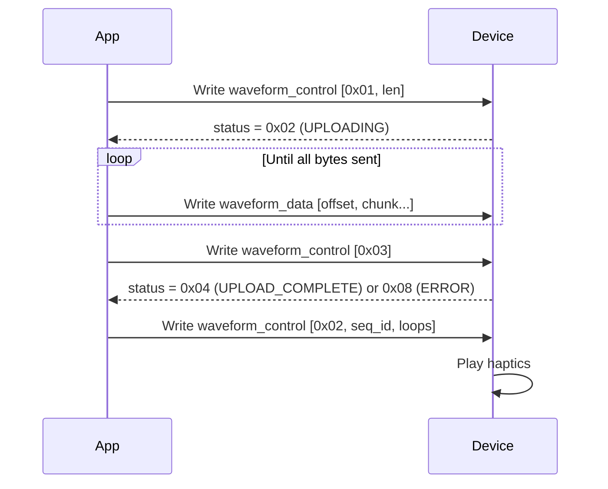
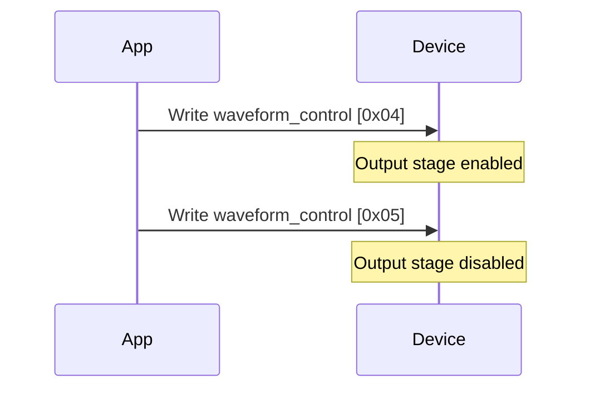
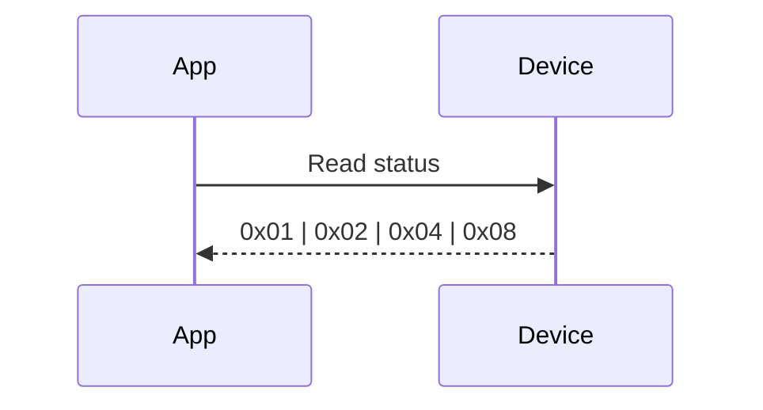

# DA728x BLE Haptics Protocol

This document describes the BLE GATT interface exposed by the `demo-ble` firmware.

## Device Info

| Property | Value |
|----------|-------|
| Advertised name | `DA728x Haptics` |
| GAP appearance | `Unknown` |
| Connection | LE only, general discoverable |

---

## GATT Service: HapticsService

**Service UUID:** `DA728000-0000-1000-8000-00805F9B34FB`

| Characteristic | UUID | Properties | Size | Description |
|---|---|---|---|---|
| `waveform_data` | `DA728001-0000-1000-8000-00805F9B34FB` | Write | 20 bytes | Chunked waveform memory upload |
| `waveform_control` | `DA728002-0000-1000-8000-00805F9B34FB` | Write | 3 bytes | Command interface |
| `status` | `DA728003-0000-1000-8000-00805F9B34FB` | Read | 1 byte | Current device state |

---

## `status` (Read)

| Value | Name | Meaning |
|-------|------|---------|
| `0x01` | `STATUS_READY` | Device idle / ready |
| `0x02` | `STATUS_UPLOADING` | Receiving waveform data |
| `0x04` | `STATUS_UPLOAD_COMPLETE` | Waveform committed successfully |
| `0x08` | `STATUS_ERROR` | Last operation failed |

---

## `waveform_control` (Write)

Packet format: `[cmd: u8, arg1: u8, arg2: u8]`

| Command | Value | `arg1` | `arg2` | Description |
|---------|-------|--------|--------|-------------|
| `CMD_START_UPLOAD` | `0x01` | Total length (bytes) | — | Begin a new waveform upload |
| `CMD_PLAY` | `0x02` | Sequence ID | Loop count¹ | Play a sequence |
| `CMD_COMMIT` | `0x03` | — | — | Finalize upload and write to DA728x |
| `CMD_ENABLE` | `0x04` | — | — | Enable the DA728x output stage |
| `CMD_DISABLE` | `0x05` | — | — | Disable the DA728x output stage |

¹ The firmware plays the sequence `loops + 1` times.

---

## `waveform_data` (Write)

Packet format: `[offset: u8, data...]`

| Field | Size | Description |
|-------|------|-------------|
| `offset` | 1 byte | Write offset into the 100-byte waveform memory (0–99) |
| `data` | 1–19 bytes | Payload bytes to write at that offset |

Total packet size must not exceed the 20-byte characteristic limit.

---

## Waveform Memory Layout

The firmware expects a raw 100-byte image compatible with `da728x::waveform::WaveformMemory`:

| Offset | Content |
|--------|---------|
| `0` | Number of snippets (1–15; ID 0 is reserved silence) |
| `1` | Number of sequences (1–16) |
| `2+` | End pointers, snippet data, then sequence data |

For details on how to build a valid image, see the [waveform builder](../waveform-builder/) or the `da728x::waveform` Rust API.

---

## Typical Flows

### Upload & Play a Custom Waveform

### Enable / Disable Output

### Read Current Status

---

## Notes

- **Chunking:** The App is responsible for chunking the 100-byte image into multiple `waveform_data` writes. The firmware does not enforce ordering, but offsets must not overlap and the total must equal the `len` given to `CMD_START_UPLOAD`.
- **Commit validation:** On `CMD_COMMIT`, the firmware checks that `received_len >= expected_len`. If not, `STATUS_ERROR` is returned.
- **No notifications:** The `status` characteristic is read-only. The App should poll it after sending commands if it wants to confirm outcomes.
